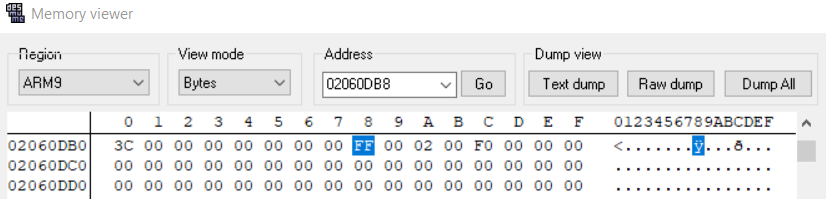

# Brick Breaker - Reverse Engineering

## Ideas

Given a file with an extension of `.nds`, which turns out to be a `Nintendo DS ROM Image file`. In order to emulate it, we need an emulator, and one of the well known emulator which we also used later is [DeSmuME](http://desmume.org/download/).


Seen the game is emulated with a bricks indicating one of the `flag` character gives us a thought about a concept of cheating, either bypasing all the levels, making the player an immortal life, modifying the game's attribute or carving secrets through the game's assets, like **sprites**, **tiles** and **maps**.

For the asset itself, there's nothing much, except from the map which uncovers the two crucial attribute, the player's remaining **lives** and **current score**.


We can locate those attributes from the `RAM` memory through `RAM Search` and `RAM Watch`. Throughout blind debugging with `RAM Search` in a search for those initial values, we spotted that the **life** is stored in `0x02060DB8`. This can be determined since we also see the `Changes` column of the RAM to check if the data is already altered `n-times`.


We can modify this in the Memory directly so that we can keep playing the game without worrying the life.





However towards playing it, we encounter another problem that the level **will be resetted after Level 4**. This means after the block `f` (level 1), `l` (level 2), `a` (level 3), `g` (level 4), the level will be back to level 1, as there's a handler that stopping us to go forward the next level.

In order to check what's going on, we can use [Tinke](https://github.com/pleonex/tinke) or manual Ghidra loading of the ROM Game just like the reference [here](https://www.starcubelabs.com/reverse-engineering-ds/).
There will be the `fat.bin`, `banner.bin`, `arm7.bin` and `arm9.bin`. We'll focus on the `arm9.bin` since it responsibles for storing the main core system of the game.

We can use DSLazy or ndstool to dump them.

### ndstool
```
ndstool -9 arm9.bin -7 arm7.bin -y9 y9.bin -y7 y7.bin -d data -y overlay -t banner.bin -h header.bin -x <ROM path>
```

Once done, we load the `arm9.bin` with an ARM processor variant `v5t`. Analyzing it statically throughout the **cross-references** calls , reveal that the program levelling handler is located at `0x02001B74`.
This is possible since one of the function call located after the initialization of life pointer, which is defined in the data `0x02060DB8`.


Altering the local variable doesn't work for us, but we can check that it returns the local variable that stores the pointer address to these levels.

```asm
                             LAB_02001c92                                    XREF[20]:    02001b84 (j) , 02001b92 (j) , 
                                                                                          02001ba0 (j) , 02001bae (j) , 
                                                                                          02001bbc (j) , 02001bca (j) , 
                                                                                          02001bd8 (j) , 02001be6 (j) , 
                                                                                          02001bf4 (j) , 02001c02 (j) , 
                                                                                          02001c10 (j) , 02001c1e (j) , 
                                                                                          02001c2c (j) , 02001c3a (j) , 
                                                                                          02001c48 (j) , 02001c56 (j) , 
                                                                                          02001c64 (j) , 02001c72 (j) , 
                                                                                          02001c80 (j) , 02001c8e (j)   
        02001c92 18  1c           add        r0,r3,#0x0
        02001c94 10  bd           pop        { r4, pc }

```

We can put the breakpoint in the 0x2001c94 and alters the `r4` register. Since viewing the memory state through the value `r4` registers reveal the level's string as well.


We alter this one by one and revealing the flag levels, breaking the flag loops.

The images below are screenshotted by D13David to view all the level brick designs, which represent the flag characters.


His solution is also pretty quick, and can be viewed [here](https://github.com/D13David/ctf-writeups/tree/main/tenablectf23/rev/brick_breaker).

## Flag

flag{Br3Ak0U7!!1}
