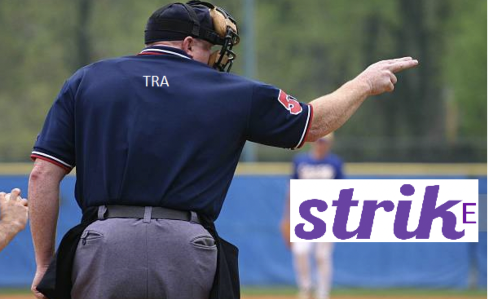
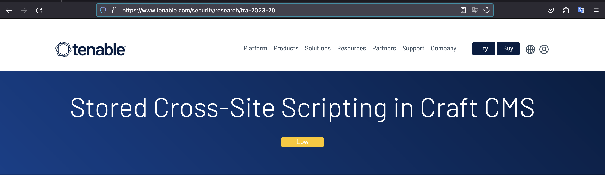
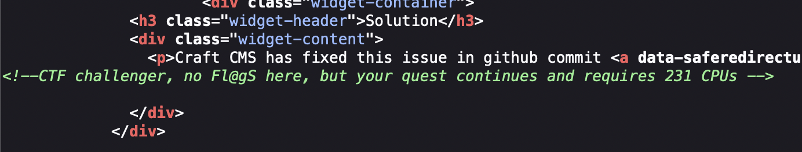
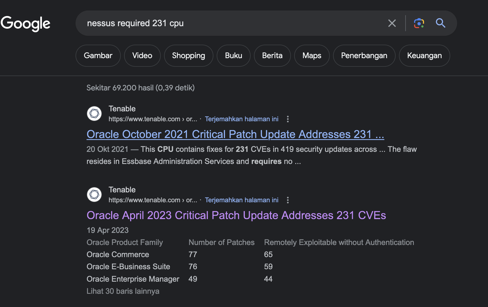
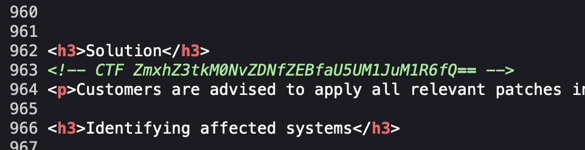

# 3 Strikes and you’re out! - Tenable Publications

Given image, from the image found the tra word.

## Ideas

1. By searching in google using `nessus tra` as keyword, found link : https://www.tenable.com/security/research , by choosing one tra, found the pattern tra-xxx-xx 
2. After scraping the `tra-xxx-xx` , found link : https://www.tenable.com/security/research/tra-2023-20 , with comment `<!--CTF challenger, no Fl@gS here, but your quest continues and requires 231 CPUs -->` 

3. By searching in google using `nessus required 231 cpu` as keyword, found link : https://www.tenable.com/blog/oracle-april-2023-critical-patch-update-addresses-231-cves and found base64.

## Flag

flag{d3Cod3_d@_iNT3Rn3Tz}