# Confinement - Hard

Given an .ad1 file which is an image file that contains image data that could be opened with FTK Imager. Basically, it's a disk dump.

## Dissecting .ad1 file
Finding the proper FTK Imager versions. We're using v4.7.1 to load the file.

Load the image file to FTK Imager

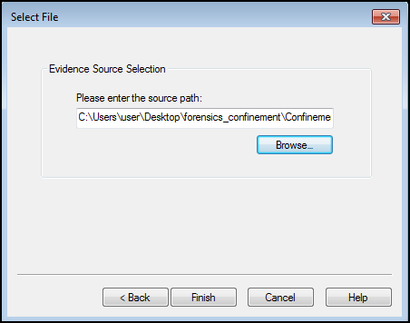

As we can see here, all files on `C:\users\tommyxiaomi\documents\` is encrypted with ransomware

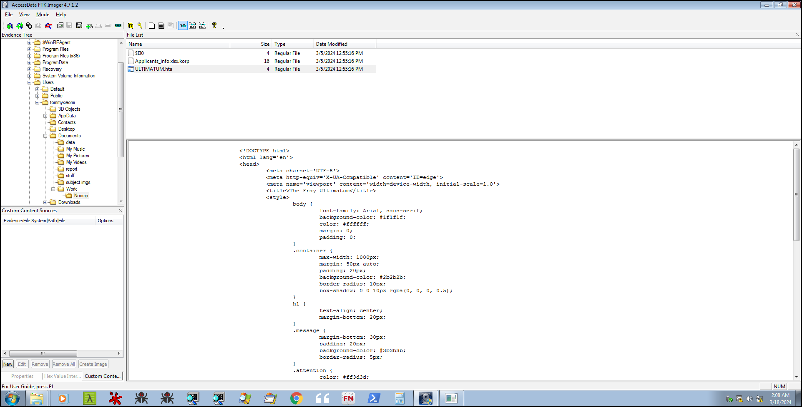

Here is the ransom notes (Fray Ultimatum) with some FactionID on the bottom of the notes.

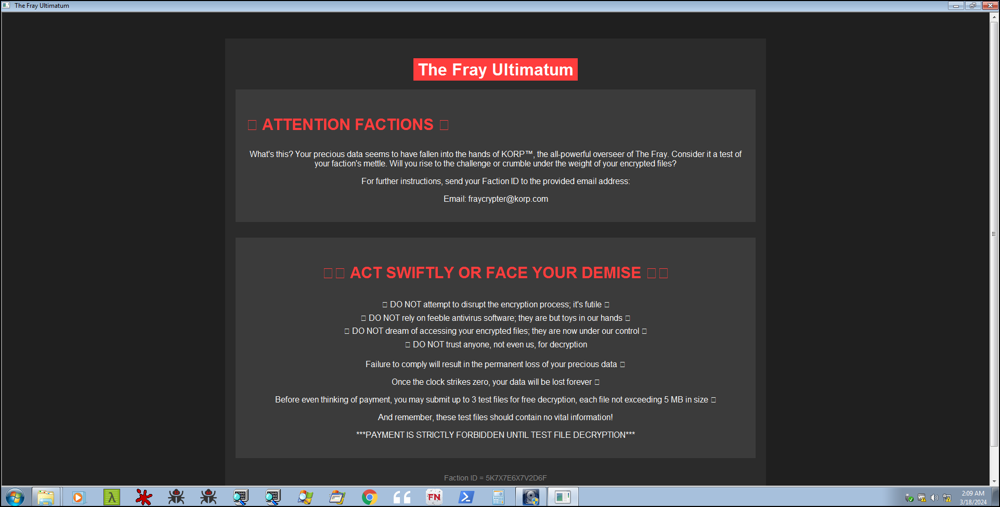

## Analyzing Logs

First thing first, on a ransomware case we need to obtain some important log files such as system, security, powershell event logs or registry file to see if the ransomware is storing some important command / strings that could be used to decrypt the file. On powershell event logs we could acquire some suspicious logs that could determine the entry point of the ransomware. We could extract the powershell operational logs from `C:\Windows\System32\winevt\Logs`

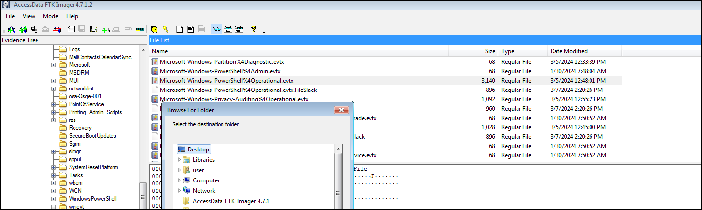

Load the powershell event on event viewer to inspect the suspicious logs.

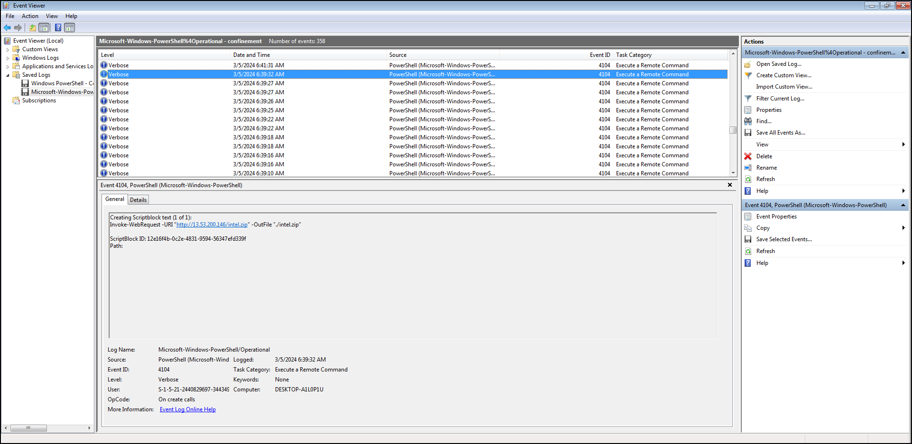

As we can see below, malicious actor injected some command to execute the ransomware and disabling windows defender shortly after downloading and executing those files.

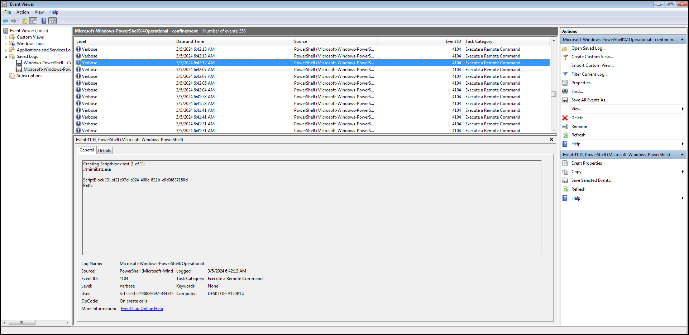
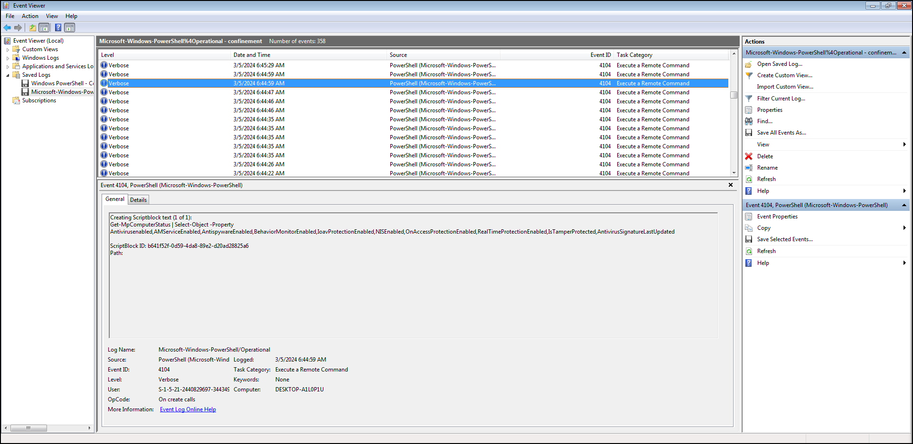
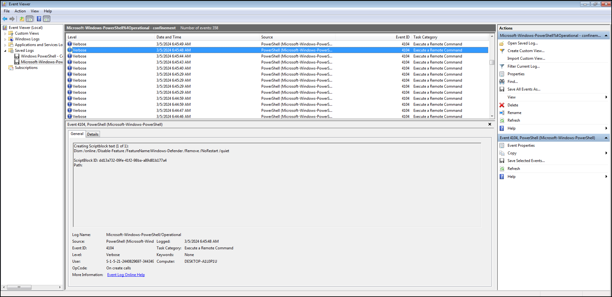

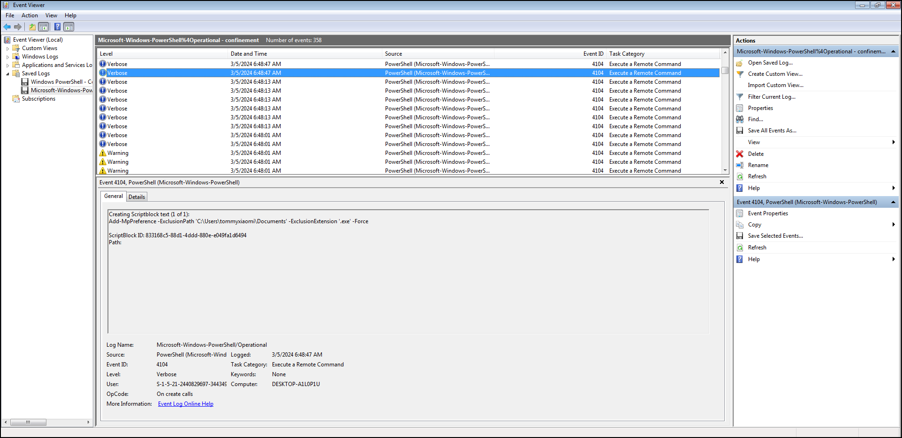

Below is the decrypter.exe is executed by the attacker and all those .exe file deleted after.

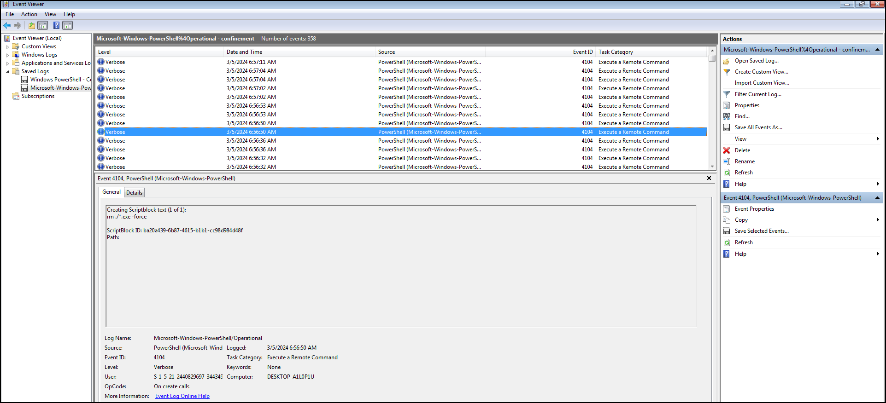

## Obtaining Ransomware Program

We have questions about retrieving those malicious .exe, how we could extract that if those files were deleted? If we traceback to the event logs, the attacker was disabling the Windows Defender shortly after the execution of the ransomware. We could extract those file on Windows Defender quarantine folder, because defender quarantined those malicious file into "Quarantine" folder to check if those files are malicious and "sandboxed" it. We got those ideas from this website [https://blog.khairulazam.net/2023/12/12/extracting-quarantine-files-from-windows-defender/]()

Extract quarantined files from `C:\Program Data\Microsoft\Windows Defender\Quarantine\Resource Data`. Those files were encrypted with RC4 encryption. Use the decryption.exe from website above.

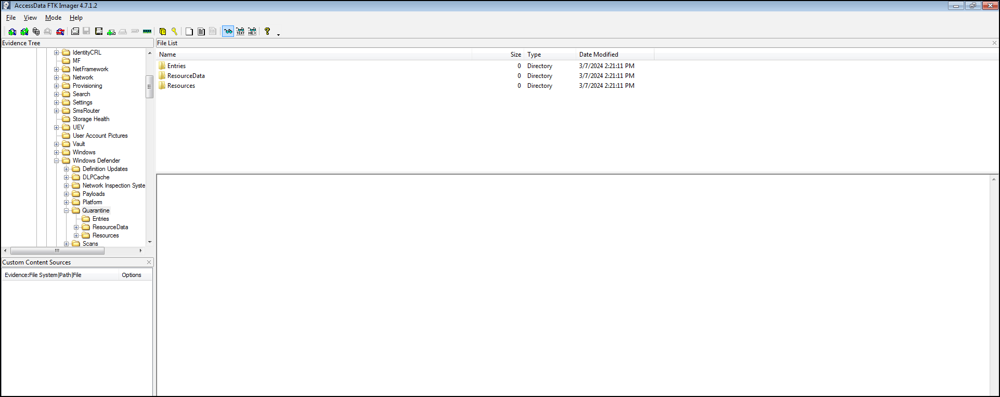
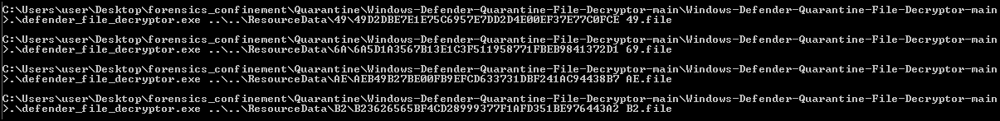

## Reversing Ransomware

After decryption, we got the encrypter program. Put it on dnSpy for decompiling C# code. We could see the encryption algorithm and reverse that to decrypt our .korp file.
Details: [https://blog.compass-security.com/2022/11/a-symmetric-cipher-ransomware-yes/]()

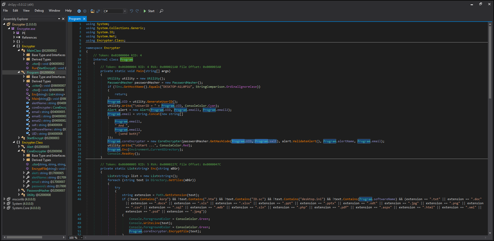
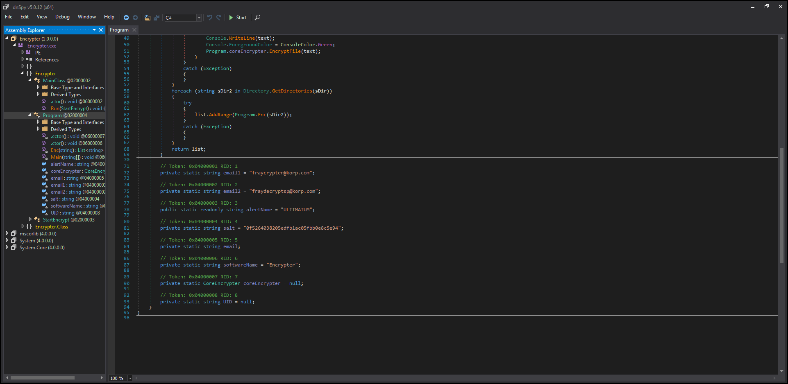

So, how to decrypt? first we need the key which is the faction id from .hta file + salt then it will be hashed with SHA2(512) algorithm then will be converted to base64, after that we will obtain the PBKDF2 key with salt (00 01 01 00 01 01 00 00) and SHA1 algorithm

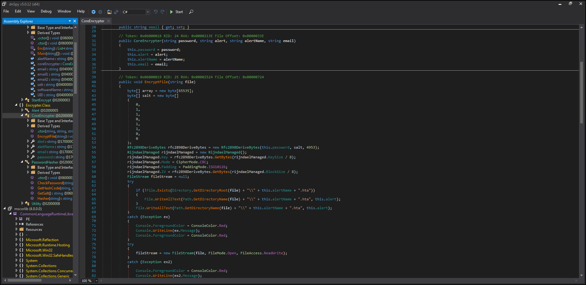
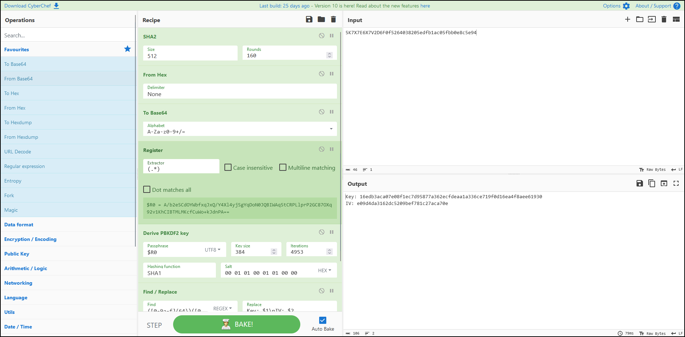

We got the key and iv to obtain our flag!!
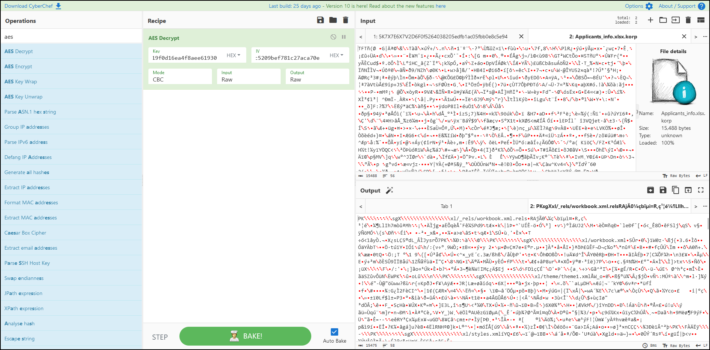
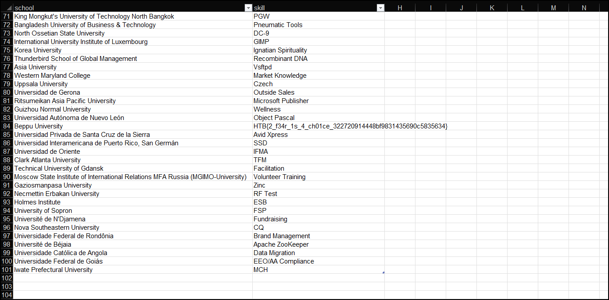

### Key Takeaways
1. Never run any pirated program / click any attachments from suspicious people.
2. Always backup your data.
 