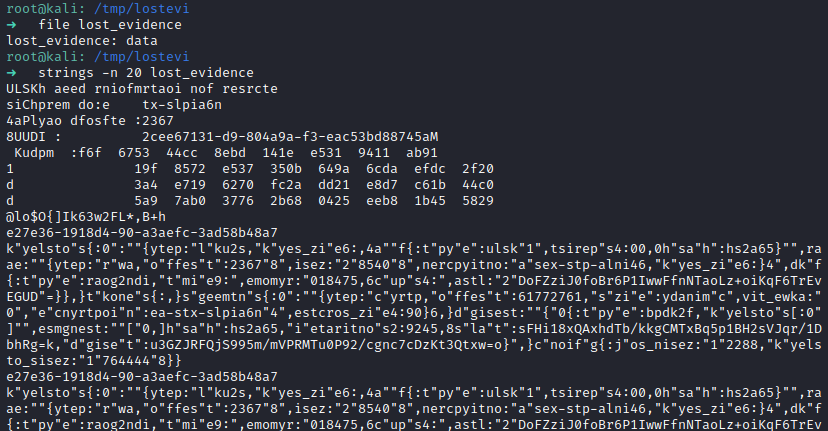
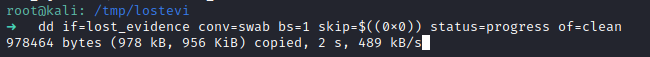
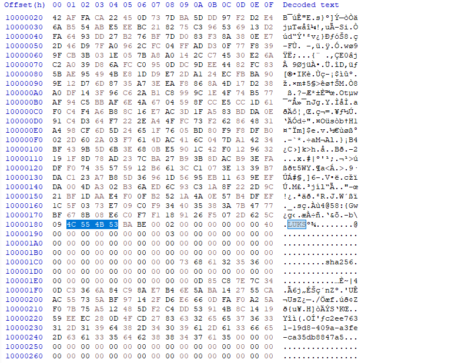
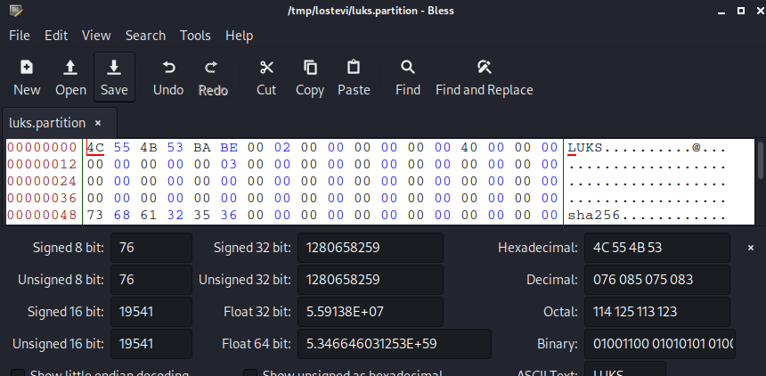
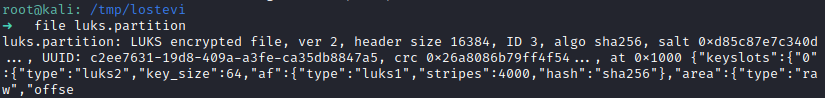
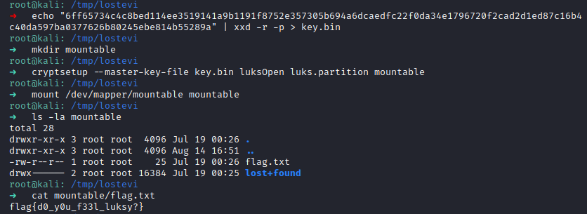

# Lost Evidence - Forensic

1. Given a dump file with swapped endian. Swap the endian to gain the original dump file.

    It will make sense if we swap the endian.

    `dd if=lost_evidence conv=swab bs=1 skip=$((0x0)) status=progress of=clean` to reverse the endian.

2. Find the offset of JSON LUKS metadata / Magic Bytes. 
    
    We got the offset `0x10000180`
    

3. Dump the file with dd again starting on LUKS header.

    
    
    Delete the first byte
    

    

4. Successfully recovered the LUKS partition.

    

5. There is a LUKS Header information of secret that we can use to gain the master key for decrypting. We can use the MK dump as a master key.

    

    

Reference: https://gitlab.com/cryptsetup/LUKS2-docs/-/blob/main/luks2_doc_wip.pdf?ref_type=heads

## Flag: flag{d0_y0u_f33l_luksy?}

